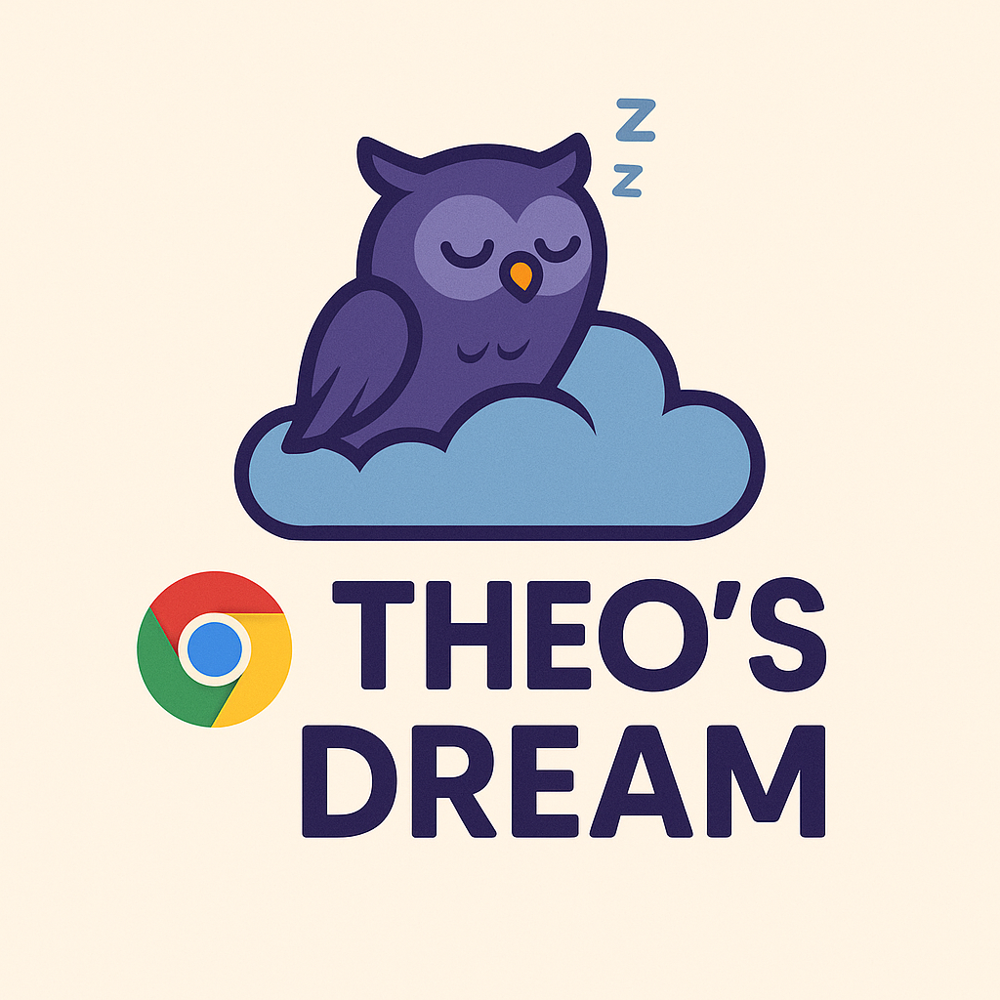

# Theo's dream Chrome Extension



🎬 A Chrome extension that automatically shows YouTube Shorts recommendations when you watch long videos from specific channels.

## Features

- **Smart Detection**: Automatically detects when you're watching videos longer than a configurable threshold (default: 10 minutes)
- **Channel Targeting**: Only triggers on specified YouTube channels (customizable)
- **Beautiful Popup**: Shows an attractive popup with YouTube Shorts recommendations
- **Fully Customizable**: Configure target channels, video length threshold, and popup duration
- **Modern UI**: Clean, responsive design with smooth animations
- **Privacy Focused**: All settings stored locally, no data sent to external servers

## Installation

### Method 1: Load as Unpacked Extension (Development)

1. **Download the Extension**
   - Clone or download this repository to your computer
   - Extract the files to a folder (e.g., `Theo's dream`)

2. **Open Chrome Extensions Page**
   - Open Google Chrome
   - Navigate to `chrome://extensions/`
   - Or go to Menu → More Tools → Extensions

3. **Enable Developer Mode**
   - Toggle the "Developer mode" switch in the top-right corner

4. **Load the Extension**
   - Click "Load unpacked" button
   - Select the folder containing the extension files
   - The extension should now appear in your extensions list

5. **Pin the Extension** (Optional)
   - Click the puzzle piece icon in Chrome's toolbar
   - Find "Theo's dream" and click the pin icon

## Usage

### Basic Usage

1. **Navigate to YouTube**
   - Go to any YouTube video from a configured channel
   - The extension works automatically in the background

2. **Watch Long Videos**
   - When you watch a video longer than the threshold (default: 10 minutes)
   - From a target channel (configurable in extension options)
   - A popup will appear with YouTube Shorts recommendations

3. **Interact with Popup**
   - Click on any short video thumbnail to open it in a new tab
   - Click "Maybe Later" to dismiss the popup
   - Click "Settings" to configure the extension
   - The popup stays visible until manually closed

### Configuration

1. **Open Settings**
   - Click the extension icon in Chrome's toolbar
   - Or right-click the extension icon and select "Options"

2. **Configure Channels**
   - Add or remove YouTube channel names
   - Channel names should match exactly as they appear on YouTube
   - You can add as many channels as you want

3. **Adjust Threshold**
   - **Video Length Threshold**: 5-60 minutes (default: 10 minutes)

4. **Enable/Disable**
   - Use the toggle switch to enable or disable the extension
   - Settings are saved automatically

## File Structure

```
youtube-shorts-popup/
├── manifest.json          # Extension configuration
├── content.js            # Main logic for detecting videos
├── background.js         # Background service worker
├── popup.css            # Styles for the shorts popup
├── options.html         # Settings page HTML
├── options.js           # Settings page JavaScript
└── README.md           # This file
```

## Privacy Policy

- **No Data Collection**: This extension does not collect or transmit personal data
- **Local Storage**: All settings are stored locally in your browser
- **YouTube Access**: Only accesses YouTube pages to detect video information
- **No Analytics**: No usage tracking or analytics

## Contributing

Contributions are welcome! Please feel free to submit issues, feature requests, or pull requests.

## Support

If you encounter any issues or have questions:

1. Check the troubleshooting section above
2. Look for similar issues in the project repository
3. Create a new issue with detailed information about the problem

---

**Enjoy discovering new YouTube Shorts while watching your favorite long-form content!** 🎉